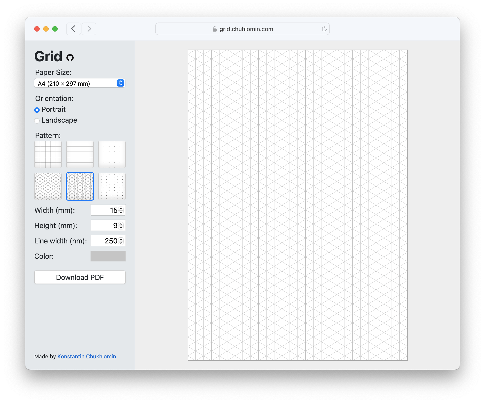

# grid

[](https://github.com/chuhlomin/calendar/actions/workflows/main.yml)

Grid patterns PDF generator. Select paper size, customize pattern and download PDF.

https://grid.chuhlomin.com



## Local development

It's a static site that deployed to CloudFlare Pages.

To run it locally, make sure you have installed:

- [Go](https://golang.org) 1.21+
- [TinyGo](https://tinygo.org) 0.30.0
- [Wrangler](https://developers.cloudflare.com/workers/cli-wrangler/install-update)

```bash
make build dev
```

Open in browser: http://localhost:8788

### Adding new pattern

In `index.html` update `#template_patterns`.

#### Updating `static/og.png`

Open "Open Graph" in Figma. Update PNG background rectangle, tile scale 28.3%.
